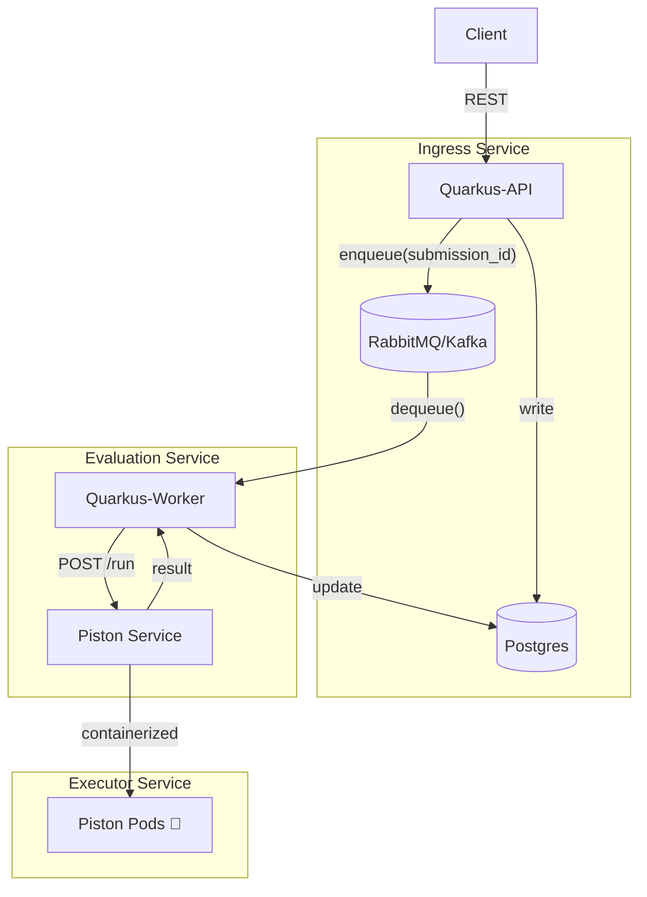

# ADR 001: Monorepo com Arquitetura de Micro‑serviços para Online Judge

**Data:** 2025-04-27  **Status:** #aceito

## Contexto e Problema

O sistema de Online Judge deve receber submissões de código de forma assíncrona e permitir que:

- A **API de entrada** persista submissões e publique mensagens de enfileiramento (fila).
    
- **Workers** consumam essa fila e deleguem a execução ao serviço Piston.
    
- O **Piston Service** execute o código num ambiente isolado.
    

Para suportar picos de submissões e variar a capacidade de processamento, Worker Service e Piston Service precisam escalar de maneira independente.

## Decisão

Adotar um **monorepo** contendo três módulos Maven distintos:

1. **common/**
    
    - Biblioteca compartilhada contendo entidades de domínio, Value Objects, DTOs e interfaces (Ports) usadas por todos os serviços.
        
2. **ingress-service/**
    
    - Serviço Quarkus responsável por expor endpoints REST, persistir dados em Postgres e enfileirar submissões.
        
3. **evaluation-service/**
    
    - Serviço Quarkus headless que consome filas (RabbitMQ/Kafka), faz HTTP POST para o Piston Service e atualiza resultados no banco.
        

Além disso, o **Executor Service** roda como contêiner independente (imagem Docker oficial ou customizada), gerenciado por um Deployment e HPA próprio.

## Arquitetura

## Consequências

### Vantagens

- **Desacoplamento**: Ingress, Evaluator e Executor escalam e são deployados separadamente.
    
- **Consistência**: `common` mantém um único modelo de domínio e contratos.
    
- **CI/CD otimizado**: cada módulo gera artefato e imagem Docker independente.
    
- **Observabilidade**: métricas e health-checks específicos por serviço.
    

### Desvantagens

- **Overhead de configuração**: setup de monorepo, builds e pipelines para três módulos.
    
- **Gerência de versões**: necessidade de versionar corretamente `common` e alinhar dependências.
    
- **Infra adicional**: broker de mensagens e orquestração de múltiplos Deployments.
    

---
