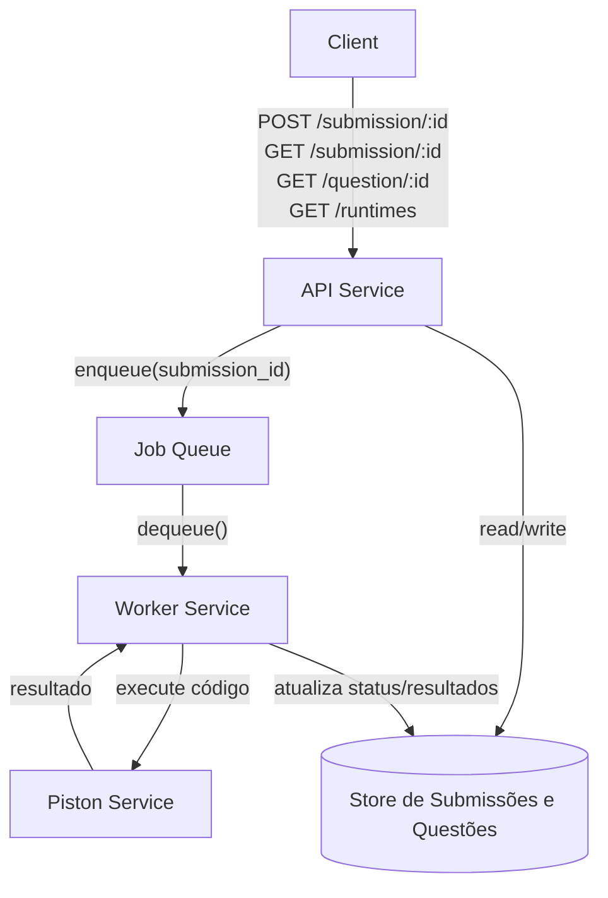
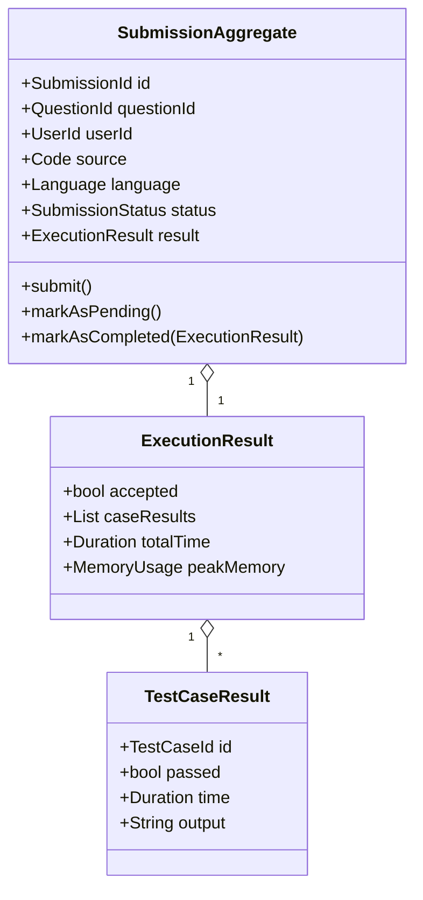

# Ideia geral
A ideia geral do projeto é criar uma pagina com desafios estilo "leet-code" diários, uma das inspirações do projeto é o jogo termo, onde todos os usuários que acessarem o site naquele dia receberão o mesmo desafio. 

# Desafios de implementação
A plataforma funciona como se fosse apenas uma parte de um online judge, então a implementação passa a ser de um online judge.

O funcionamento básico de um online judge contempla a execução de um código de uma submissão, que está vinculada à uma questão e por sua vez tem os casos de teste e limitações de tempo de execução e memória.

Uma submissão é considerada um sucesso quando todos seus casos de teste são aprovados dentro das limitações estabelecidas.

Para esse projeto, utilizaremos o [[piston]] como um serviço de execução de código, abaixo destrincharei algumas das rotas possíveis para a aplicação

- GET questions/id
		retorna a definição da questão (descrição, limites, exemplos)
- GET runtimes
		lista as linguagens/versões disponíveis no Piston
- POST submissions/question_id
		recebe { language, source }, dispara execução e retorna submission_id
- GET submission/id
		consulta o status e resultado (aceito/rejeitado, tempo, memória, logs)

